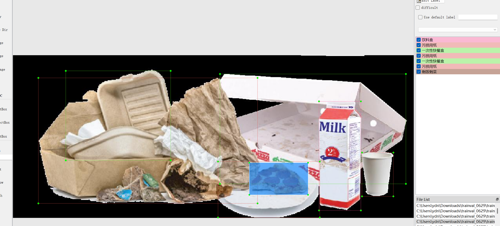
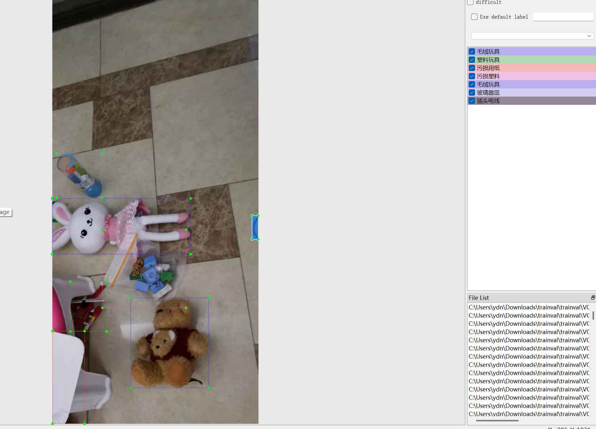

# Dataset for Garbage Identification and Object Detection

Dataset Information: A total of 19,655 images are included in this dataset, with corresponding annotation files. The formats of the annotation files include VOC-XML and YOLO-txt.

The number of images and bounding box counts per column are as follows: there are 48 types of objects to be identified, with the following count information:

Note: An image may contain multiple objects, so the total number of bounding boxes might be greater than the total number of images.

The complete dataset includes three folders and one txt file:
- all_images folder: Stores the dataset's images, screenshots as follows:
- all_txt folder and classes.txt: Stores the yolo-txt annotation files, which have the same number as the images, with each annotation file corresponding to an image.
- classes.txt:
For a detailed understanding of the yolo-txt standard file, please search for it on your own. In short, the number 0 represents the name of the object at position 0 in the array in classes.txt.
- all_xml folder: VOC-XML annotation files. They match the number of images, with each annotation file corresponding to an image.
- For a detailed understanding of the VOC-XML standard file, please search for it on your own.
Both formats of annotation can be used, choose one according to your needs.
Annotation effect screenshots:

## Images

Here is a pay link on Stripe ( https://buy.stripe.com/3cs8yP7sY87d0vu9AB ). Please contact me lonlonago@foxmail.com after funding $89, and I will send you a complete data files , thank you!

